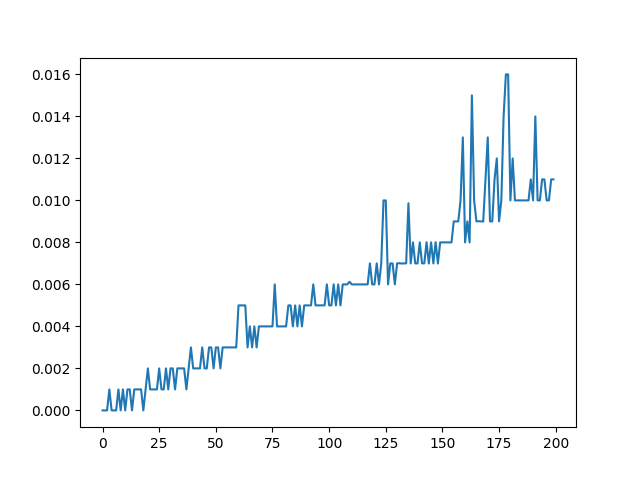

***Техническое задание 2***
=
### Функционал программы
1. Функции чтения из файла, поиска минимального числа, поиска максимального числа, сложения и умножения всех чисел из файла
2. Тесты для проверки корректности функций поиска минимума, максимума, сложения и умножения
3. Тесты для проверки скорости работы программы при увеличении размера входного файла
4. Тест для проверки меньшинства минимального числа в сравнении с максимальным
5. График зависимости времени выполнения от кол-ва чисел в файле

Ссылка на телеграм чат с ботом: https://t.me/tz2test

***Техническое задание 3***
=
### ***Описание системы***

#### Цель:
Спроектировать мобильное приложение для доставки еды на дом

#### Функционал:
- Авторизация в приложении
- Личный кабинет
- Создание заказа
- Отслеживание статуса заказа.
- Оплата заказа
- Способность оставлять отзывы
- Передача заказа от клиента к ресторану и от ресторана к курьеру
- Доставка заказа клиенту

https://github.com/maxturyev/HSE_TP/blob/main/ТЗ%20№3/ТЗ%20№3.pdf

